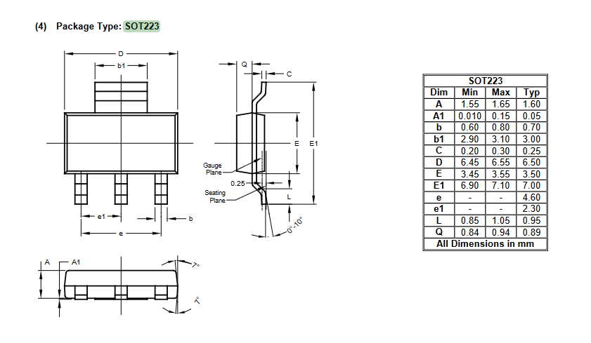
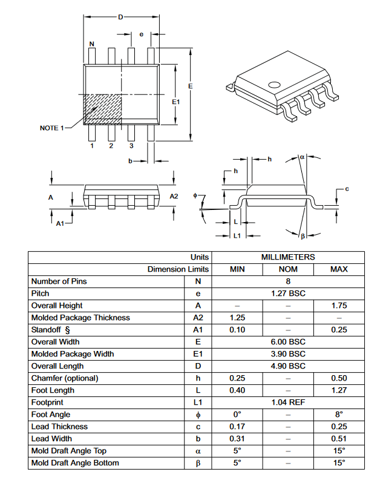
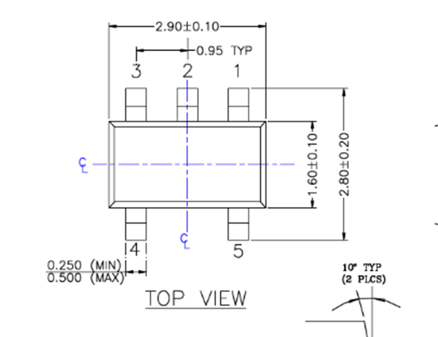

What we have right now:  
  
dim: 6.5x7  
price: 0.56  
conclusion: overall okay, but big and with maximum current of 1A overkill for our usecase. For the alternatives, i searched for a buck regulator with a max current of 500mA thats smaller.

alternative:  
  
dim: 4.9x6  
price: 0.64  

smallest possible:  
  
dim: 2.9x2.8  
price: 1.11